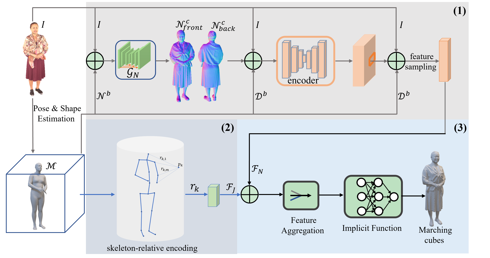
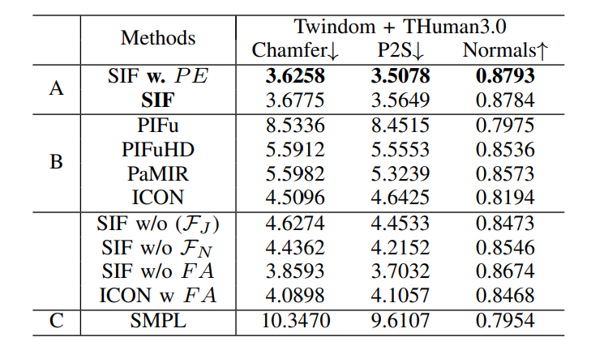

<p align="center">

  <h1 align="center">SIF: Skeleton-aware Implicit Function for Single-view Human Reconstruction</h1>
 <br />
 <a href="">
    
  </a>
</div>


-  <a href="https://github.com/mkocabas/PARE">PARE (SMPL)</a>, <a href="https://github.com/HongwenZhang/PyMAF">PyMAF (SMPL)</a> are all supported as optional HPS.
<br>

<!-- TABLE OF CONTENTS -->

<details open="open" style='padding: 10px; border-radius:5px 30px 30px 5px; border-style: solid; border-width: 1px;'>
  <summary>Table of Contents</summary>
  <ol>
    <li>
      <a href="#who-needs-ICON">Who needs SIF</a>
    </li>
    <li>
      <a href="#todo">TODO</a>
    </li>
    <li>
      <a href="#installation">Installation</a>
    </li>
    <li>
    <a href="#RGB based Experiments"> RGB based Experiments</a>
    </li>
    <li>
      <a href="#Train & Eval">Train Eval</a>
    </li>
  </ol>
</details>


## Who needs SIF?
- Given an RGB image, you could get:
  - image (png): segmentation, normal images (body + cloth), overlap result (rgb + normal)
  - mesh (obj): SMPL body, reconstructed clothed human
  

## TODO

- pretrained models (*self-implemented version)
- PIFu* (RGB image + predicted normal map as input)
- PaMIR* (RGB image + predicted normal map as input, w/ PyMAF/PARE as HPS)
- dataset processing pipeline
- [x] training and evaluation codes

## Installation

Please follow the [requirenments](requirements.txt) and [environment](environment.yaml) to setup all the required packages
<br />
Please follow the [Data Preprocess](https://github.com/YuliangXiu/ICON/blob/master/docs/training.md) to generate the train/val/test dataset from raw scans (THuman2.0).

## RGB based Experiments

We have show more RGB base experiments, i.e. **RGB based ablation study**.

[RGB base experiments](pic/RGB_results.png)
 <a href="">
    
  </a>
## Train & Eval

You should get the dataset (inclued SMPL normal, SMPL detpth, joints,Normal,RGB), and set your own path.
<br />
For the training details, you can refer [config.py](config.py),[train_eval_sif](train_eval_sif.py) and [tainer_sif](trainer/trainer_sif.py)
```
python train_eval_sif.py
```

## More Qualitative Results

## Acknowledgments
Here are some great resources we benefit from:

- [ICON](https://github.com/YuliangXiu/ICON) for normal estimation and SMPL refinement, [PaMIR](https://github.com/ZhengZerong/PaMIR), [PIFu](https://github.com/shunsukesaito/PIFu), [PIFuHD](https://github.com/facebookresearch/pifuhd), and [MonoPort](https://github.com/Project-Splinter/MonoPort) for Benchmark
- [rembg](https://github.com/danielgatis/rembg) for Human Segmentation
- [PARE](https://github.com/mkocabas/PARE), [PyMAF](https://github.com/HongwenZhang/PyMAF), and [PIXIE](https://github.com/YadiraF/PIXIE) for Human Pose & Shape Estimation
- [TwinDom]() and [THuman](https://github.com/ZhengZerong/DeepHuman/tree/master/THUmanDataset) for Dataset
- [PyTorch3D](https://github.com/facebookresearch/pytorch3d) for Differential Rendering


